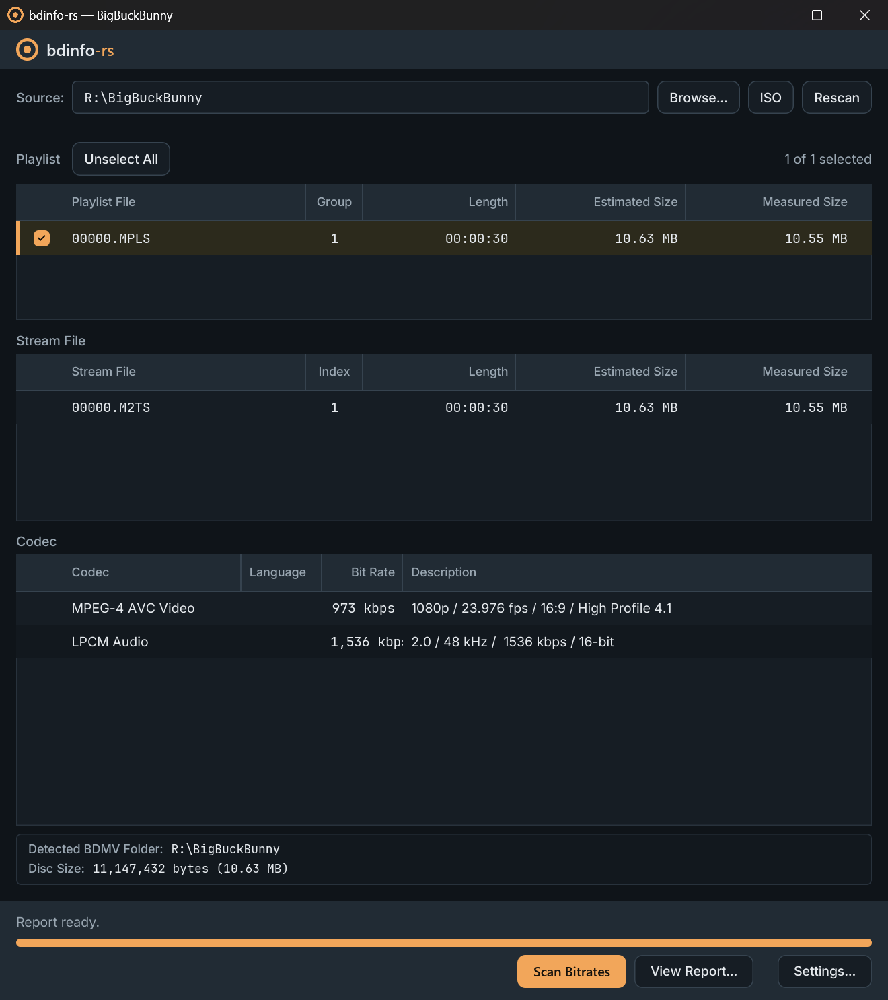

<div align="center">

# bdinfo-rs

**A memory-safe Blu-ray disc analyzer — the classic [BDInfo](https://github.com/UniqProject/BDInfo) report, reimplemented in Rust.**

[](https://github.com/agentjp/bdinfo-rs/actions/workflows/ci.yml)
[](https://github.com/agentjp/bdinfo-rs/actions/workflows/fuzz.yml)
[](https://github.com/agentjp/bdinfo-rs/actions/workflows/audit.yml)
[](https://github.com/agentjp/bdinfo-rs/actions/workflows/codeql.yml)
[](https://scorecard.dev/viewer/?uri=github.com/agentjp/bdinfo-rs)
[](https://www.bestpractices.dev/projects/13304)
<br>
[](https://github.com/agentjp/bdinfo-rs/releases)
[](rust-toolchain.toml)
[](LICENSE)
[](Cargo.toml)
[](https://cloudsmith.com)

[Desktop app](#desktop-app) · [Command line](#command-line) · [Browser](#browser) · [Install](INSTALL.md) · [Differences](DIFFERENCES.md) · [About](ABOUT.md) · [Security](#quality--security)

</div>



bdinfo-rs scans `BDMV` folders and `.iso` images — playlists, clips, M2TS demux — and produces the
classic BDInfo disc report: per-stream video and audio specs, codecs, measured bitrates, resolution,
and HDR / Dolby Vision / HDR10+. One parser engine,
[`bdinfo-rs-core`](https://crates.io/crates/bdinfo-rs-core)
([docs](https://docs.rs/bdinfo-rs-core)), is the whole analyzer behind a documented API — disc
discovery, MPLS/CLPI/index parsing, M2TS demux, the codec scanners, the UDF 2.50 reader, the report
renderer — and all three front-ends are thin shells over it, so the report is byte-identical
whichever you use.

- **The BDInfo report, byte-for-byte** — deterministic across every platform and front-end.
- **Structure and metadata only** — no decryption, no circumvention, and feature content is never
  copied. It works on already-decrypted discs; analyze the ones you own.
- **Memory-safe** — `unsafe` is `forbid`-den; malformed input returns an error, never a crash.
- **Zero C** — in-house M2TS demuxer, 13 codec scanners, and UDF 2.50 `.iso` reader. No libbluray, no FFI.
- **Fast and small** — a pipelined demuxer that stays near NVMe read speed; the CLI is a ~1 MB binary with no runtime.
- **Everywhere** — Windows, macOS, and Linux on x64 and arm64, plus WebAssembly.

| Front-end | Best for | Get it |
|---|---|---|
| **Desktop app** | point and click | [Download ↓](#desktop-app) |
| **Command line** | scriptable static binary | [Install ↓](#command-line) |
| **Browser** | nothing to install | [Try it live ↗](https://bdinfo.hyperslop.dev) |

## Desktop app

Open a `BDMV` folder or `.iso`, pick playlists from the familiar three-pane view, scan with live
progress, then save or copy the report. Pure Rust and GPU-accelerated (wgpu, with a software
fallback) — no webview and no bundled runtime.

```sh
winget install agentjp.bdinfo-rs-gui              # Windows
brew install --cask agentjp/tap/bdinfo-rs-gui     # macOS
yay -S bdinfo-rs-gui-bin                          # Arch
```

| Windows | macOS | Linux |
|---|---|---|
| [`.msi` · portable `.zip`](https://github.com/agentjp/bdinfo-rs/releases?q=%22native+desktop+GUI%22&expanded=true) | [`.dmg`](https://github.com/agentjp/bdinfo-rs/releases?q=%22native+desktop+GUI%22&expanded=true) | [`AppImage` · `.deb` · `.rpm`](https://github.com/agentjp/bdinfo-rs/releases?q=%22native+desktop+GUI%22&expanded=true) |

apt/dnf, `cargo install`, the portable-mode marker, and the first-launch prompts on unsigned
Windows and macOS builds are in **[INSTALL.md](INSTALL.md#desktop-app)**.

The desktop app releases on its own `gui-v*` tags, independently of the command-line releases.

Settings, logs, and troubleshooting: [`crates/bdinfo-rs-gui`](crates/bdinfo-rs-gui).

## Command line

```sh
brew install agentjp/tap/bdinfo-rs      # macOS / Linux
winget install agentjp.bdinfo-rs        # Windows
yay -S bdinfo-rs-bin                    # Arch
cargo binstall bdinfo-rs                # Rust, prebuilt
```

Every other route — Scoop, apt/dnf, install script, Docker, prebuilt archives, from source —
is in **[INSTALL.md](INSTALL.md)**.

```sh
bdinfo-rs <BD_PATH> [REPORT_DEST]
```

`BD_PATH` takes the disc root, the `BDMV` folder, any directory inside it, or an `.iso`. The report
is written to `REPORT_DEST` as `BDINFO.{volume label}.txt` — defaulting to the disc folder, and
required for an `.iso`.

```sh
bdinfo-rs D:\Rips\MY_MOVIE                       # playlist table, then pick interactively
bdinfo-rs my_movie.iso C:\Reports                # an .iso needs an explicit report folder
bdinfo-rs D:\Rips\MY_MOVIE --list                # print the playlist table, scan nothing
bdinfo-rs D:\Rips\MY_MOVIE --mpls 00800,00801    # scan exactly these playlists
bdinfo-rs D:\Rips\MY_MOVIE --whole               # scan everything the table lists
```

The table hides short playlists and looping ones, and names what it withheld.
`--show-short-playlists` and `--show-looping-playlists` put each category back — into the table,
the picker, and `--whole`. `--short-playlist-seconds` moves the cutoff a playlist has to reach to
count as long, 20 seconds by default:

```sh
bdinfo-rs D:\Rips\MY_MOVIE --short-playlist-seconds 60   # hide anything under a minute
```

The report renders every section by default. `--no-stream-diagnostics` drops the per-playlist
`STREAM DIAGNOSTICS` tables — the widest part of the file — and `--no-quick-summary` drops the
`QUICK SUMMARY` blocks. Each omits exactly its own section and changes nothing else.

A run on a terminal opens with the bdinfo-rs banner; `--no-banner` drops it. Piped or redirected
output never carries it.

Unreadable files on a damaged disc are collected into a `WARNING` block and the rest is scanned
(exit code 3). Whatever a failing stream file measured before the error is kept; `--drop-partial`
discards it instead. An AACS-encrypted disc is refused before anything is measured (exit code 4) —
only ciphertext would reach the demuxer — though `--list` still works, its output being read from
the disc's own database.

Release archives ship bash / zsh / fish / PowerShell completions and a `bdinfo-rs.1` man page.

## Browser

**[bdinfo.hyperslop.dev](https://bdinfo.hyperslop.dev)** runs the full measured scan in the page.
Nothing is uploaded — there is no server. Files are read at byte offsets via `FileReaderSync` in a
Web Worker, so a multi-GB stream never has to fit in memory.

The same analyzer is on npm as [`@bdinfo-rs/wasm`](https://www.npmjs.com/package/@bdinfo-rs/wasm):

```ts
import { inspect, scan } from "@bdinfo-rs/wasm";

const picked = [...input.files].map((file) => ({ path: file.webkitRelativePath, file }));

const disc = await inspect(picked);     // structural scan: playlists, streams, chapters, sizes
const { report } = await scan(picked);  // the classic disc report, as a string
```

`inspect` reads metadata only — pass `{ codecs: true }` for the full codec detail without the
whole-file demux — and `scan` measures the streams, returning the report alongside the same disc
model. `renderReport` re-renders that model with different report sections, and `reportFileName`
gives the `BDINFO.{volume label}.txt` name to save it under. Every call takes either a folder pick
or a single `.iso` `File`. Bundler, CSP, and browser-support notes:
[`crates/bdinfo-rs-wasm`](crates/bdinfo-rs-wasm).

## Differences from BDInfo

The report follows the classic format byte-for-byte, except where the original is provably wrong
against the codec specification or FFmpeg — there, bdinfo-rs emits the correct value.

**[DIFFERENCES.md](DIFFERENCES.md)** has the exact before/after for every divergence, flags which
ones appear on a normal disc, and lists how the desktop app differs from the BDInfo GUI.

Filing an [output difference](https://github.com/agentjp/bdinfo-rs/issues/new?template=output_difference.yml)?
Paste the **text report** — codecs, bitrates, stream layout — never audio or video. A
[blu-ray.com](https://www.blu-ray.com) link to the release helps identify the disc.

## Quality & security

Every push and pull request runs the full gate:

- **Build and test** on Linux, Windows, and macOS. `unsafe` is `forbid`-den, so a green build *is*
  the memory-safety guarantee.
- **100% line / region / function coverage**, enforced.
- **Max-strictness lints** — clippy `pedantic` + `nursery` + `cargo` and a restriction set (no
  indexing panics, no silent integer wrap, no `unwrap` on input) as hard errors; docs-as-errors.
- **Supply chain** — `cargo deny` (advisories, license allowlist, a no-C-dependencies ban) and
  `cargo vet`, plus CodeQL and dependency review.
- **Mutation testing, zero surviving mutants.** A mutant must make a test fail or carry a written
  proof that it is equivalent.
- **Fuzzing, no panics and no hangs.** Every untrusted-input parser has a libFuzzer target; pull
  requests replay the committed corpus, releases fresh-fuzz.

The lint gate, mutation policy, and fuzz corpus are all in the repository — clone it and reproduce
the results. Report vulnerabilities per [SECURITY.md](SECURITY.md).

## Lineage & license

Ported from [UniqProject BDInfo](https://github.com/UniqProject/BDInfo) (report and analysis)
following [BDInfoCLI](https://github.com/tetrahydroc/BDInfoCLI) (console flow), with codec edge cases
cross-checked against [libbluray](https://code.videolan.org/videolan/libbluray) and
[FFmpeg](https://ffmpeg.org/), and the UDF reader validated against
[libudfread](https://code.videolan.org/videolan/libudfread) and the OSTA UDF 2.50 specification. Not
affiliated with or endorsed by BDInfo; see [NOTICE](NOTICE) for attribution.

[LGPL-2.1-or-later](LICENSE) — the library may be used from applications under other licenses;
changes to bdinfo-rs itself must be shared under the same terms. Derived from BDInfo
(© 2010 Cinema Squid), also LGPL-2.1-or-later.

Package repository hosting (apt/dnf) is graciously provided by
[Cloudsmith](https://cloudsmith.com).

Why this project exists, and how it is built and maintained: [ABOUT.md](ABOUT.md).
